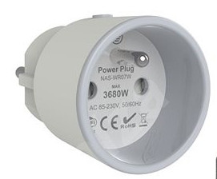
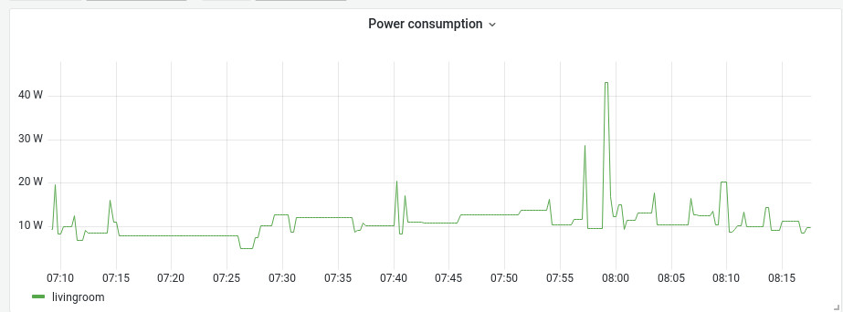

# Tuya exporter for prometheus

Prometheus exporter for [Tuya](https://iot.tuya.com/)-based smart plug devices.
Tested with Immax Neo Lite smart plug.



### Setup

- Obtain device ID and key, [here is excellent guide](https://github.com/codetheweb/tuyapi/blob/master/docs/SETUP.md) by @codetheweb
- Populate config file, [here is an example](config.yaml):

```yaml
- name: plug-kitchen-1
  id: 87e98a987b87b12354a54c
  key: 0987654321abcdef
  ip: 192.168.1.5
```

### Run locally

```shell
./exporter
ts=2024-02-25T08:18:50.577Z caller=main.go:83 level=info msg="Starting tuya_smartplug_exporter" version="(version=v1.0.0, branch=main, revision=9d0b7b3)" config=config.yaml
ts=2024-02-25T08:18:50.582Z caller=main.go:98 level=info msg="Configured 1 devices"
ts=2024-02-25T08:18:50.583Z caller=tls_config.go:313 level=info msg="Listening on" address=[::]:9999
ts=2024-02-25T08:18:50.583Z caller=tls_config.go:316 level=info msg="TLS is disabled." http2=false address=[::]:9999
```

### Run using docker

```shell
docker run -ti -v $(pwd)/config.yaml:/config.yaml:ro ghcr.io/rkosegi/tuya-smartplug-exporter:v1.0.1
```

### Example output

```shell
curl --silent localhost:9999/metrics | grep ^tuya
tuya_smartplug_current{device="livingroom-1"} 0.093
tuya_smartplug_exporter_build_info{branch="",goversion="go1.18.6",revision="",version=""} 1
tuya_smartplug_last_scrape_error 0
tuya_smartplug_power{device="livingroom-1"} 8.6
tuya_smartplug_scrape_duration_sum{device="livingroom-1"} 73
tuya_smartplug_scrape_duration_count{device="livingroom-1"} 1
tuya_smartplug_scrapes_total 60
tuya_smartplug_voltage{device="livingroom-1"} 242.9
```

### Install using Helm chart to k8s cluster

First, make sure your values are present in file `my-values.yaml`, then run

```shell
helm repo add rkosegi https://rkosegi.github.io/helm-charts/ --force-update
helm upgrade --install rkosegi/tuya-smartplug-exporter --values my-values.yaml
```

### Sample Grafana dashboard




### Acknowledgment

Portion of client code is inspired by @jasonacox implementation in [powermonitor](https://github.com/jasonacox/powermonitor)
